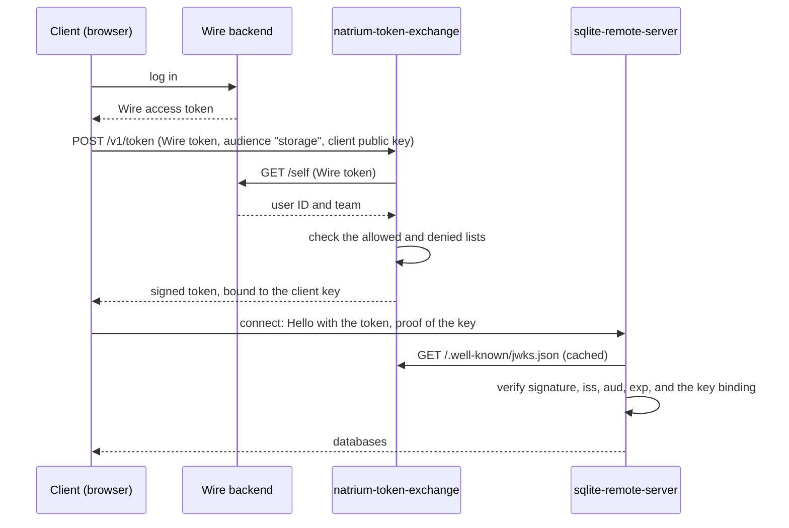

# natrium-token-exchange

The token exchange of [Natrium](https://github.com/SchwarzDigits/natrium). A client that is logged in to Wire exchanges
its Wire access token for a short-lived token for one of Natrium's servers: a
[sqlite-remote-server](https://github.com/SchwarzDigits/sqlite-remote-server) that stores its databases, or the
[natrium-pin-service](https://github.com/SchwarzDigits/natrium-pin-service) that protects its key file with a PIN. The
service issues tokens only to the users its lists of allowed and denied teams and users admit, so that not everyone
with a Wire account can use these servers. The servers verify the tokens offline with the service's public keys, and
only this service ever sees Wire access tokens.

Status: works and is tested, not yet in production use. Versions are 0.x: the API can still change.

## Why

Natrium clients in the browser keep their encrypted databases on a sqlite-remote-server, so that they survive when the
browser clears its storage. Such a server must not be open to anyone on the internet, and whether someone may use it
is a question about their Wire account: are they a member of a team the operator serves? The storage server itself
should not have to ask Wire, though. It serves many connections for hours, and it should keep working while Wire is
briefly unavailable.

This service answers the question once per token. It checks the Wire access token with the Wire backend, applies the
operator's lists of allowed and denied teams and users, and issues a signed token that lives for an hour by default.
The storage server verifies that token offline, with the public keys the service publishes. The PIN service does the
same with its own tokens, so it never holds a Wire access token, which acts for the user at Wire.

- **A gate, not the protection of the data.** The databases are encrypted by the clients, and each belongs to the
  client key that created it. The token only decides who may connect and store at all.
- **Bound to a key.** A storage token names the client's Ed25519 key (RFC 7800 `cnf`), and the storage server asks for
  a proof of that key at every connection. A copied token is useless.
- **One token per server.** Each kind of token names its server in `aud`, so neither server accepts the other's
  tokens.
- **No state.** The service has no database. Any number of instances can run with the same configuration.

## How it works



The client asks for a new token at half its lifetime. The storage server ends a connection when its token expires,
and the client reconnects with a new one, so a user who loses access is out after one token lifetime at the latest.

A browser that restores its key file asks for a token with the audience `pin` instead, without a key, since it has
none yet, and presents it to the PIN service.

The [documents](docs/README.md) describe the [protocol](docs/protocol.md), [operations](docs/operations.md) and the
[threat model](docs/threat-model.md).

## API

```
POST /v1/token
Authorization: Bearer <Wire access token>
Content-Type: application/json

{"audience": "storage", "publicKey": "<base64url Ed25519 public key>"}
```

| `audience` | Token for | `publicKey` | Default lifetime |
|---|---|---|---|
| `storage` | the storage server | required: the client's key for the storage server, 32 bytes in base64url without padding (RFC 4648, section 5) | 1 hour |
| `pin` | the PIN service, if configured | not allowed | 10 minutes |

The answer is `{"token": "<JWT>", "expiresIn": 3600}`, with the lifetime in seconds.

Errors have the body `{"error": "<code>"}`:

| Status | Code | When |
|---|---|---|
| 400 | `bad_request` | not one JSON object with known fields, more than 1 KiB, an unknown audience, a missing or unusable key for `storage`, a key for `pin` |
| 401 | `unauthorized` | no Bearer token, or Wire rejects it |
| 403 | `not_allowed` | the lists do not admit the user |
| 429 | `too_many_requests` | the user reached a limit: too many tokens, or too many keys in use; `Retry-After` gives the seconds to wait |
| 503 | `unavailable` | Wire cannot be reached or gives no usable answer, or too many token checks run at once (with `Retry-After: 1`) |
| 500 | `internal` | an error in the server |

The server checks in this order: token, admission, body with audience and key, limits, then it issues. Pages of any
origin may call the API (CORS with `*`, without credentials): the token is set by the client in the header, not added
by the browser.

```
GET /.well-known/jwks.json
```

returns the public keys as a JSON Web Key Set. The storage server and the PIN service verify the tokens with it.

## Running

```sh
go install github.com/SchwarzDigits/natrium-token-exchange/cmd/...@latest

new-signing-key -key-id 2026-09     # prints 2026-09:<base64url seed>, a secret

NATRIUM_TOKEN_EXCHANGE_WIRE_API_URL=https://nginz-https.wire.example/v15 \
NATRIUM_TOKEN_EXCHANGE_ISSUER=https://token.example \
NATRIUM_TOKEN_EXCHANGE_STORAGE_AUDIENCE=wss://vfs.example/v1/ws \
NATRIUM_TOKEN_EXCHANGE_PIN_AUDIENCE=https://pin.example \
NATRIUM_TOKEN_EXCHANGE_SIGNING_KEYS='2026-09:<base64url seed>' NATRIUM_TOKEN_EXCHANGE_CURRENT_KEY_ID=2026-09 \
NATRIUM_TOKEN_EXCHANGE_ALLOWED_TEAMS='*' NATRIUM_TOKEN_EXCHANGE_DENIED_TEAMS=<team UUID> natrium-token-exchange
```

The server listens on one port and serves:

| Path | Purpose |
|---|---|
| `/v1/token` | the API |
| `/.well-known/jwks.json` | the public keys, for the storage server and the PIN service |
| `/.well-known/live` | liveness probe, always 200 |
| `/.well-known/ready` | readiness probe, 200 while the server serves; it has no store to wait for |
| `/metrics` | Prometheus metrics: requests by result, tokens by audience, duration of the token check, users counted against the limits |

Expose `/v1/token` and `/.well-known/jwks.json` only, not the probes and the metrics. The server logs JSON to stdout
and shuts down on SIGINT and SIGTERM after running requests have finished. It keeps no state: any number of instances
can run side by side with the same configuration.

### Configuration

| Variable | Required | Default | Meaning |
|---|---|---|---|
| `NATRIUM_TOKEN_EXCHANGE_PORT` | no | `8080` | port for the API, the key set, the probes and the metrics |
| `NATRIUM_TOKEN_EXCHANGE_WIRE_API_URL` | yes | | base URL of the Wire API with the API version, e.g. `https://nginz-https.wire.example/v15`. Must be https |
| `NATRIUM_TOKEN_EXCHANGE_ISSUER` | yes | | the `iss` claim, e.g. `https://token.example`. The servers expect it |
| `NATRIUM_TOKEN_EXCHANGE_STORAGE_AUDIENCE` | yes | | the `aud` claim of storage tokens: the storage server, e.g. `wss://vfs.example/v1/ws` |
| `NATRIUM_TOKEN_EXCHANGE_STORAGE_TOKEN_TTL` | no | `1h` | lifetime of a storage token, whole seconds from `1m` to `24h` |
| `NATRIUM_TOKEN_EXCHANGE_PIN_AUDIENCE` | no | | the `aud` claim of PIN tokens: the PIN service, e.g. `https://pin.example`. Must differ from the storage audience. Unset: no PIN tokens |
| `NATRIUM_TOKEN_EXCHANGE_PIN_TOKEN_TTL` | no | `10m` | lifetime of a PIN token, whole seconds from `1m` to `24h` |
| `NATRIUM_TOKEN_EXCHANGE_SIGNING_KEYS` | yes | | the keys in the key set, comma-separated, each `<key ID>:<base64url seed>` as printed by `new-signing-key`. A secret |
| `NATRIUM_TOKEN_EXCHANGE_CURRENT_KEY_ID` | yes | | the key that signs new tokens, one of `SIGNING_KEYS` |
| `NATRIUM_TOKEN_EXCHANGE_ALLOWED_TEAMS` | see below | | team UUIDs whose members get tokens, or `*` for every member of a team, comma-separated |
| `NATRIUM_TOKEN_EXCHANGE_DENIED_TEAMS` | no | | team UUIDs whose members get no tokens, or `*`, comma-separated |
| `NATRIUM_TOKEN_EXCHANGE_ALLOWED_USERS` | see below | | qualified user IDs `<uuid>@<domain>` who get tokens, or `*` for every user, comma-separated |
| `NATRIUM_TOKEN_EXCHANGE_DENIED_USERS` | no | | qualified user IDs who get no tokens, or `*`, comma-separated |
| `NATRIUM_TOKEN_EXCHANGE_TOKEN_LIMIT` | no | `60/1h` | tokens of both audiences one user gets from one instance per window, `<n>/<window>` |
| `NATRIUM_TOKEN_EXCHANGE_KEY_LIMIT` | no | `10/24h` | distinct client keys one user has in use at one instance; a key is in use until a window has passed since its last token |
| `NATRIUM_TOKEN_EXCHANGE_MAX_CONCURRENT_WIRE_CHECKS` | no | `64` | token checks with Wire that run at once; a request beyond it gets `503` without asking Wire |
| `NATRIUM_TOKEN_EXCHANGE_LOG_LEVEL` | no | `info` | `debug`, `info`, `warn` or `error` |

At least one allowed team or allowed user is required; without any, the service would admit nobody. An invalid value
stops the start with a message that names the variable.

The most specific entry that matches a user decides, and a denial wins over an admission of the same specificity:
first the user's own ID, then the user's team, then `*` in the team lists (for users with a team), then `*` in the
user lists. A user no entry matches gets no token. A user without a team matches no team entry. Examples:

| Who gets tokens | `ALLOWED_TEAMS` | `DENIED_TEAMS` | `ALLOWED_USERS` | `DENIED_USERS` |
|---|---|---|---|---|
| members of any team except two | `*` | `<team 1>,<team 2>` | | |
| the members of one team, and one guest | `<team>` | | `<user>` | |
| every user except the members of one team | | `<team>` | `*` | |
| every member of a team except one user | `*` | | | `<user>` |

### Embedding

Programs that read their configuration differently, for example from the variables of a deployment platform, build
a `server.Config` and call `server.Run`:

```go
keys, err := server.ParseSigningKeys(signingKeys) // "2026-09:<base64url>,2026-12:<base64url>"
if err != nil {
	return err
}
cfg := server.DefaultConfig()
cfg.Addr = ":8080"
cfg.WireAPIURL = "https://nginz-https.wire.example/v15"
cfg.Issuer = "https://token.example"
cfg.StorageAudience, cfg.PinAudience = "wss://vfs.example/v1/ws", "https://pin.example"
cfg.SigningKeys, cfg.CurrentKeyID = keys, "2026-12"
cfg.AllowedTeams, cfg.DeniedTeams = []string{"*"}, []string{blockedTeamID}
err = server.Run(ctx, cfg, logger) // returns after ctx is canceled and the server has shut down
```

`Config.Validate` reports an invalid field as a `*server.ConfigError` with the Go field name, so the caller can name
its own setting in the message.

## Development

| | |
|---|---|
| Tests | `go test -race ./...` |
| Lint | `golangci-lint run` |
| Against a real backend | `NATRIUM_TOKEN_EXCHANGE_TEST_WIRE_API_URL=…/v15 NATRIUM_TOKEN_EXCHANGE_TEST_WIRE_TOKEN=<access token> go test ./internal/wireauth -run Live` |

## Layout

| Path | Content |
|---|---|
| `cmd/natrium-token-exchange` | the command: reads the environment and calls `server.Run` |
| `cmd/new-signing-key` | creates a signing key and prints its entry |
| `server` | `Config`, `Validate` and `Run`, the public API |
| `config` | the environment variables of the command. `LoadFrom` reads them through a function, for programs that receive the settings under other names |
| `internal/httpapi` | `POST /v1/token` and the key set: order of the checks, error codes, CORS, logs and metrics |
| `internal/signing` | the signing keys, the tokens and the key set |
| `internal/allow` | the lists of allowed and denied teams and users |
| `internal/limits` | the limits of tokens and keys per user |
| `internal/wireauth` | the check of Wire access tokens with `GET /self` |
| `internal/platform` | logging, probes, metrics, panic recovery, graceful shutdown, process protection |

## License

Apache License 2.0, see [`LICENSE`](LICENSE).
